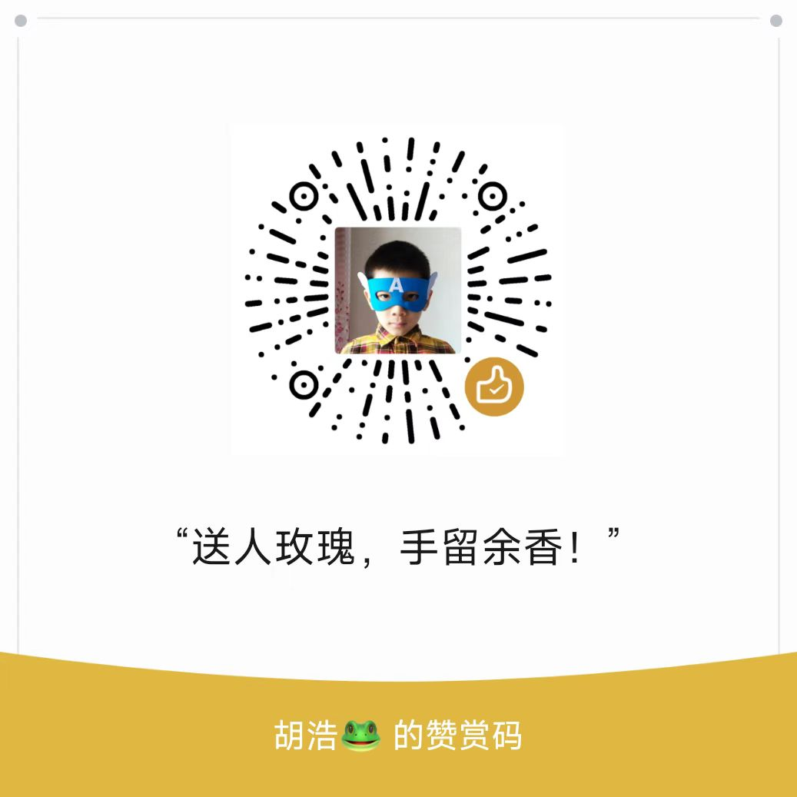

# 如何培养孩子的好奇心与创造力

培养孩子的**好奇心与创造力**，就是在点燃他们内心的探索引擎。一个好奇的孩子，才会愿意主动去看、去问、去想、去创造；而创造力，是21世纪最稀缺、最珍贵的核心能力之一。

---

## ✅ 一、什么是好奇心与创造力？

| 能力     | 表现                 | 意义               |
| ------ | ------------------ | ---------------- |
| 🔍 好奇心 | 喜欢提问、探索未知、尝试新事物    | 是学习动力的源头，能激发主动思考 |
| 🎨 创造力 | 不拘一格地思考、表达和解决问题的能力 | 是未来面对复杂问题的核心竞争力  |

---

## ✅ 二、好奇心与创造力为何会被“抹平”？

| 家庭常见做法              | 对孩子的影响        |
| ------------------- | ------------- |
| 孩子问问题时被打断/敷衍        | 减弱提问欲望，害怕表达   |
| 过早强调“标准答案”          | 限制发散思维，害怕犯错   |
| 把“乱涂乱画、胡思乱想”看作“不正经” | 扼杀自由表达，抑制创意萌芽 |

---

## ✅ 三、培养策略一：保护并激发“好奇心”本能

### ✅ 1. 用“好奇”回答“好奇”，鼓励多问多想

> 孩子问：“为什么天是蓝的？”
> 不要说：“你以后就知道了。”
> 而可以说：“你觉得可能有哪些原因？”再一起查找答案。

→ 把每一个“为什么”都当作“思维起点”。

---

### ✅ 2. 营造一个“允许提问”的安全氛围

* 设立“问题墙”或“好奇本”，鼓励孩子把想问的写下来
* 家长可以每天也分享一个“我今天很好奇的事”

→ 家庭变成一个“有趣的问题空间”，而不是只有答案的地方。

---

### ✅ 3. 拓展视野，激发新奇感

> 经常带孩子去接触多样化的事物，如：

* 博物馆、科技馆、自然场景、实验活动
* 观看纪录片、非主流主题绘本、世界各地的文化现象

→ 刺激大脑产生新连接，让好奇“有素材可燃烧”。

---

## ✅ 四、培养策略二：创造力是“允许+练习”出来的

### ✅ 1. 提供“开放式材料”和“无标准答案任务”

| 材料            | 玩法                             |
| ------------- | ------------------------------ |
| 积木、乐高、纸箱、废旧纸卷 | 不给说明书，让孩子自由组合                  |
| 开放问题          | “如果你有隐形能力，你会怎么用？”、“火星上会不会有学校？” |

→ 不追求“像不像”，而是“有没有新想法”。

---

### ✅ 2. 创设“表达空间”，鼓励自由表达

> 举例：

* 画图不必涂满，故事不必有逻辑
* 自己编歌、编舞、编故事、编规则
* 玩“变一变”游戏：把一只鞋想象成10种用途

→ 孩子的想象力不是空想，而是创造力的前奏。

---

### ✅ 3. 鼓励“失败”和“奇怪想法”，而不是打压

* 孩子说“我想造一个可以飞的书包”，不要笑或说“不可能”

> 而是说：“那你觉得它怎么飞？用什么动力？”

* 做实验失败了，也可以说：

> “真棒，你又试出了一种‘不能成功’的方法！”

→ 创造力的核心是敢于尝试，不怕出错。

---

## ✅ 五、家庭练习活动推荐

| 活动          | 方法                       | 培养能力        |
| ----------- | ------------------------ | ----------- |
| ✍ 创意接龙故事    | 一人一句，接力编故事               | 创造表达 + 发散思维 |
| 🎨 “变形画”游戏  | 把圈画成动物，把线变成山水等           | 想象力 + 图像思维  |
| 📦 自制“万能盒”  | 给一堆材料（纸盒、吸管、瓶盖），随意组合成新物品 | 动手创造力       |
| 🎭 角色扮演剧    | 自导自演，孩子扮演角色处理问题          | 表达力 + 情境创造  |
| 🧠 “如果我是……” | “如果我是风”、“如果我是猫”，你会做什么？   | 抽象转换能力      |

---

## ✅ 六、家长的引导话术模板

| 场景         | 可说的话                |
| ---------- | ------------------- |
| 孩子提出奇思妙想   | “真有趣！你是怎么想到的？”      |
| 孩子失败了      | “失败也是一种发现方法呢！”      |
| 孩子不敢画/写/表达 | “没有对错，想怎么画/写就怎么来”   |
| 孩子问“这对不对”  | “你觉得呢？如果换一种角度会怎么样？” |

---

## ✅ 七、别急着“纠正”，让想象自由流动

* 孩子说：“月亮是被绳子拉上去的。”
  不要立刻纠正说“不是啦，它是地球卫星。”
  可以说：“哇～你觉得是谁拉的？这根绳子是连在哪儿的？”

→ 孩子的“错”可能是创意的苗头，别急着用“科学”扑灭想象。

---

## 🎯 总结一句话：

**好奇心是求知的发动机，创造力是改变世界的工具。**
你的任务不是灌输知识，而是帮孩子守护好这两样宝藏。

---
加我微信 
  
给我打赏 

---
