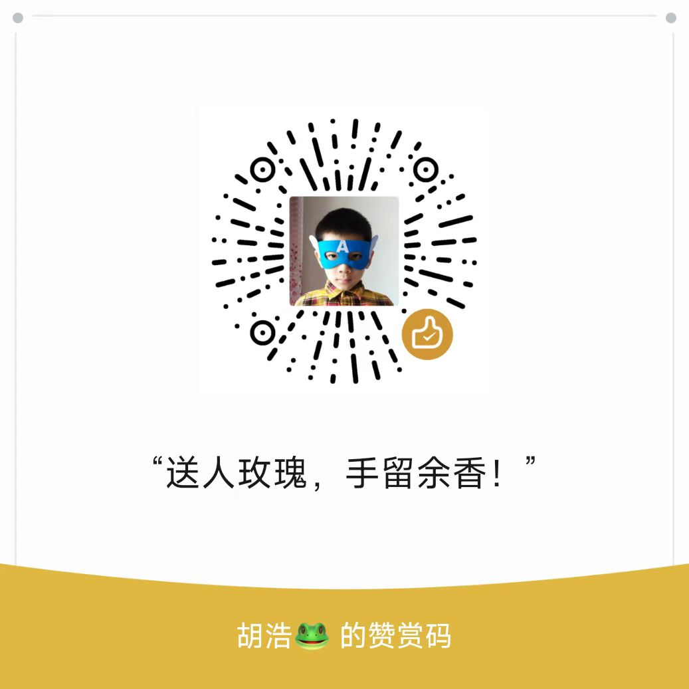

# 怎样培养孩子的表达与沟通能力

培养孩子的**表达与沟通能力**，不仅有助于他们在人际交往中更自信、更受欢迎，也能增强他们的逻辑思维、情绪表达和社会适应力。这是影响孩子一生的重要“软实力”。

---

## ✅ 一、什么是表达与沟通能力？

| 能力模块     | 表现为             | 意义           |
| -------- | --------------- | ------------ |
| 🗣️ 语言表达 | 说话清楚、有条理、能讲完整故事 | 提高课堂表现、自我呈现力 |
| 🤝 情绪表达  | 能表达内心想法、情绪、需求   | 增强亲子关系、情绪管理力 |
| 👂 倾听与回应 | 会听别人说、懂得接话、看人脸色 | 培养共情力、合作精神   |
| 🤔 表达逻辑  | 能说明理由、讲道理、讲清因果  | 强化思维力和说服力    |

---

## ✅ 二、不同年龄阶段的重点培养方向

| 年龄段   | 培养重点              |
| ----- | ----------------- |
| 3～6岁  | 敢开口、能说清、愿意表达      |
| 6～9岁  | 讲清逻辑、有条理地说、能听懂别人  |
| 9～12岁 | 表达观点、描述事件、展开讨论和协商 |

---

## ✅ 三、培养表达与沟通的10种实用方法

### 1. **从日常聊天中鼓励完整表达**

> 家长不要只问：“今天好吗？”
> 而是：“今天有没有发生一件特别的事？你能详细说说吗？”

* 引导孩子说“五要素”：**谁、在哪里、做了什么、为什么、结果怎样**

---

### 2. **用“扩展式回应”丰富词汇和句子结构**

> 孩子说：“我画了一只鸟。”
> 家长回应：“哇，这是一只蓝色的大鸟，它好像在飞去森林找朋友，对吗？”

→ 提供丰富表达模版，潜移默化提升语言表达力。

---

### 3. **鼓励孩子讲故事、复述、看图说话**

* 和孩子一起看图讲故事，或让他讲今天在学校的一个故事。
* “你来说说刚刚这本绘本讲了什么？最有趣的是什么？”

---

### 4. **设置“家庭小演讲”或“表达挑战”**

* 每天1分钟讲“今天我学到的一件事”
* 每周“我最喜欢的东西”分享会
* 玩“词语接龙+讲故事”：用5个词造一个故事

---

### 5. **情绪沟通卡片/画图表达情绪**

* 使用“情绪图谱”帮助孩子识别并说出情绪
* 例：“你现在是有点生气？还是失望？还是委屈？”

→ 教孩子说出：“我觉得……，因为……，我希望……”

---

### 6. **角色扮演游戏增强社交表达**

* 家庭常玩：“我是老师你是学生”
* 模拟场景：去医院、点餐、和同学发生冲突

→ 练习如何提问、表达请求、表达不满、协调分歧。

---

### 7. **鼓励提问和发表意见**

* 孩子提问时认真回应，鼓励他继续问“为什么”。
* 吃饭时讨论：“你觉得这个决定好不好？为什么？”

→ 培养观点表达 + 论据支持的能力。

---

### 8. **进行“非暴力沟通”训练**

> 模板：

1. 我观察到……
2. 我感觉……
3. 因为我需要……
4. 我希望……

例如：“你打断我说话，我有点生气，因为我希望被听完。我希望你下次能等我讲完再说。”

---

### 9. **注重“倾听能力”的培养**

* 玩“我说你做”游戏：考察是否听清楚步骤
* 和孩子练习“复述”：听别人说完再用自己的话说一遍

---

### 10. **减少打断、代替、否定孩子的表达**

> ❌ “你说什么乱七八糟的！”
> ✅ “你能再慢一点，说清楚你刚刚的意思吗？”

→ 给予表达空间比“纠正错误”更重要。

---

## ✅ 四、通过阅读与写作提升表达力

* 阅读多样书籍（故事类、说明类、新闻类）
* 每周写一篇“图文日记”或“趣事分享”，不重形式，重完整性
* 读后复述：说说你读完故事的感受/想法/启发

---

## 🌱 总结：沟通力 = 敢表达 + 会表达 + 理解别人

> 🎯“语言是思维的镜子，表达是未来最重要的竞争力。”

---
加我微信 
  
给我打赏 

---
